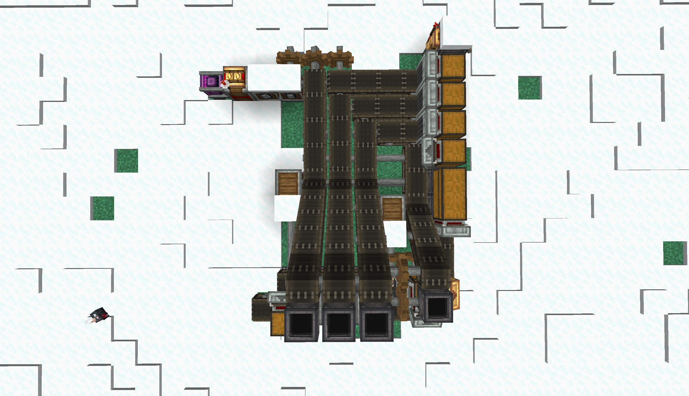

# 机械动力-三机械手序列组装生产线设计

Date: February 27, 2025
Last edited time: February 28, 2025 9:39 AM
Tags: Create

# 概述:

设计于 DeceasedCraft-V5.5.5, Minecraft版本 1.18.2, 机械动力版本 0.5.1f.

# 生产线:

图中创造马达位置为机器的动力输入口. 机器共需3072 应力.

## 过滤器设置:

该产线包括2个黄铜漏斗, 以真空管产线为例: 

传送带输入口

不完整的xxx + 完整的xxx

传送带输出口

不完整的xxx + 基底材料

完成品输出口

完整的xxx 

## 开启生产线及更换产线生产的物品前需要:

1. 确认物品输入箱无其他物品
2. 确认传送带无其他物品
3. 确认机械手上无其他物品
4. 确认黄铜漏斗中的过滤器是否有按照 **过滤器设置** 中设置.

# 总结:

装置经测试可用. **使用时请按照开启生产线及更换产线生产的物品前需要**  进行操作.